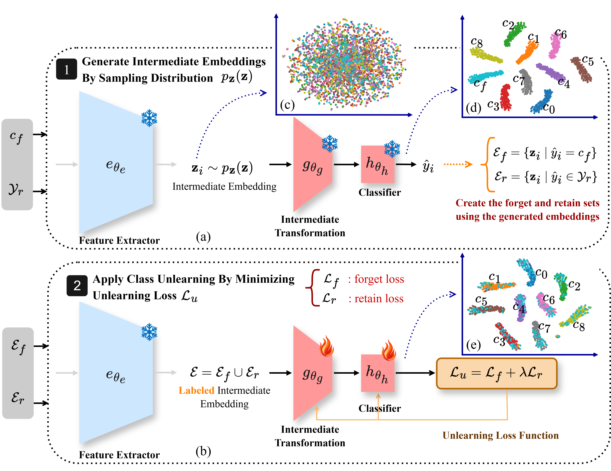

# [TMLR 2026] A Universal Source-Free Class Unlearning Framework via Synthetic Embeddings

This repository provides the official implementation of the paper [A Universal Source-Free Class Unlearning Framework via Synthetic Embeddings](https://openreview.net/forum?id=Fb2sZ1eoVe).



A source-free framework for **class unlearning** in image classification with options for
- **FC-only** unlearning using *real* or *synthetic* embeddings,
- **partial-layer** unlearning (before the last conv layer for resnet18),
- multiple unlearning **methods** and **backbones**,
- reproducible **Original** and the **Oracle** (retrain-from-scratch) upper bound.

---

## Supported Methods & Models & Datasets

**Methods**  
`FT` (Finetuning), `NG` (Negative Gradient), `NGFTW` (Negative Gradient+), `RL` (Random Labels),
`SCAR`, `BS` (Boundary Shrink), `BE` (Boundary Expand), `SCRUB`, `DELETE`

**Backbones**  
`resnet18 (ResNet-18)`, `resnet50 (ResNet-50)`, `ViT (ViT-B-16)`, `swint (Swin-T)`

**Datasets**  
`cifar10`, `cifar100` , `TinyImageNet`

---

## 0) Environment & Requirements

All Python packages are listed in **`requirements.txt`**.

```bash
# Activate your conda environment (adjust to your path if needed)
conda activate /projets/Zdehghani/torch_env

# Install dependencies
pip install -r requirements.txt
```

---

## 1) Train “Original” models

Trains N independently initialized models on the chosen dataset/backbone.

```bash
cd Source_Free_Class_Unlearning/

# Example: 1 original ResNet-18 model on CIFAR-10
CUDA_VISIBLE_DEVICES=0 python -m model_preparation.training_original \
  --model resnet18 \
  --dataset cifar10 \
  --run_original \
  --n_model 1
```

**Flags**
- `--model {resnet18|resnet50|ViT|swint}`
- `--dataset {cifar10|cifar100|TinyImageNet}`

---

## 2) Evaluate originals → CSV

Produces a CSV with baseline metrics for later comparison.

**single class unlearning:**
```bash
CUDA_VISIBLE_DEVICES=0 python -m model_preparation.test_originalmodel_singleclass
```
**multi class unlearning:**
```bash
CUDA_VISIBLE_DEVICES=0 python -m model_preparation.test_originalmodel_multiclass
```

---

## 3) Train Oracle (retrained-from-scratch)

The **Oracle** is the upper bound which is the retrained model from scratch with retainset.

**single class unlearning:**
```bash
CUDA_VISIBLE_DEVICES=0 python -m model_preparation.training_oracle \
  --model resnet18 \
  --dataset cifar10 \
  --mode CR \
  --run_rt_model
```

**multi class unlearning:**
```bash
CUDA_VISIBLE_DEVICES=2 python -m model_preparation.training_oracle \
  --model resnet18 \
  --dataset cifar100 \
  --mode CR \
  --run_rt_model \
  --num_workers 4 \
  --bsize 256 \
  --forget_mode multi \
  --num_forget_classes 2
```

---

## 4) Extract real embeddings

Computes/stores real feature embeddings used by several unlearning settings 

```bash
CUDA_VISIBLE_DEVICES=0 python -m embedding_extraction.create_embeddings
```

---

## 5) Unlearning Experiments

Make the job scripts executable once:

**single class unlearning:**
```bash
cd scripts
chmod +x job_singleclass_real.sh job_singleclass_synth.sh job_singleclass_real_part.sh job_singleclass_synth_part.sh
```
**multi class unlearning:**
```bash
cd scripts
chmod +x job_multiclass_real.sh job_multiclass_synth.sh
```

### A) FC-only unlearning with **real** embeddings

Runs FC-only unlearning using embeddings computed from real data.


**single class unlearning:**

**Args:** `dataset method lr n_model samples_per_class gpu epoch model`
```bash
# CIFAR-100, ResNet-18, 5000 samples/class, 1 model, 200 epochs on GPU 0
./job_singleclass_real.sh cifar100 FT 0.01 1 5000 0 200 resnet18
```
**multi class unlearning:**

**Args:** `dataset method lr n_model samples_per_class gpu epoch model num_forget_classes`
```bash
# CIFAR-100, ResNet-18, 500 samples/class, 1 model, 200 epochs on GPU 0, number of forget classes=10
./job_multiclass_real.sh cifar100 FT 0.01 1 500 0 200 resnet18 10
```

---

### B) FC-only unlearning with **synthetic** samples (our framework)

Uses synthetic embeddings/samples (e.g., Gaussian) for FC-only unlearning.

**single class unlearning:**

**Args:** `dataset method lr n_model samples_per_class gpu epoch model`
```bash
# Gaussian synthetic emebddings
./job_singleclass_synth.sh cifar100 FT 0.01 1 5000 0 200 resnet18 gaussian
```
**multi class unlearning:**

**Args:** `dataset method lr n_model samples_per_class gpu epoch model num_forget_classes`
```bash
# Gaussian synthetic emebddings
./job_multiclass_synth.sh cifar100 FT 0.01 1 5000 0 200 resnet18 gaussian 10
```

---

### C) Partial-layer unlearning (**before the last conv**) with **real** embeddings

**Args:** `dataset method lr n_model samples_per_class gpu epoch model`
```bash
./job_singleclass_real_part.sh cifar100 FT 0.01 1 5000 0 200 resnet18
```

---

### D) Partial-layer unlearning (**before the last conv**) with **synthetic** samples

**Args:** `dataset method lr n_model samples_per_class gpu epoch model`
```bash
./job_singleclass_synth_part.sh cifar100 FT 0.01 1 5000 0 200 resnet18
```

---

## Examples

```bash
# Train original ResNet-18 models on CIFAR-10
CUDA_VISIBLE_DEVICES=0 python -m model_preparation.training_original --model resnet18 --dataset cifar10 --run_original --n_model 1

# Evaluate originals → CSV
CUDA_VISIBLE_DEVICES=0 python -m model_preparation.test_originalmodel_singleclass

# Train Oracle on CIFAR-10
CUDA_VISIBLE_DEVICES=0 python -m model_preparation.training_oracle --model resnet18 --dataset cifar10 --mode CR --run_rt_model

# Extract real embeddings
CUDA_VISIBLE_DEVICES=0 python -m embedding_extraction.create_embeddings

# FC-only unlearning (real embeddings) with DELETE on ResNet-18
./scripts/job_singleclass_real.sh cifar10 DELETE 0.01 1 5000 0 100 resnet18

# FC-only unlearning (synthetic embeddings) with DELETE on ResNet-18 + Gaussian
./scripts/job_singleclass_synth.sh cifar10 DELETE 0.01 1 5000 0 200 resnet18 gaussian

# Partial-layer unlearning (synthetic embeddings) with DELETE on ResNet-18
./scripts/job_singleclass_synth_part.sh cifar10 DELETE 0.01 1 5000 0 200 resnet18

# Partial-layer unlearning (real embeddings) with DELETE on ResNet-18
./scripts/job_singleclass_real_part.sh cifar10 DELETE 0.01 1 5000 0 200 resnet18
```

## Citation

If you find this work useful or relevant to your research, please consider citing our paper.

```bash
@article{
dehghani2026a,
title={A Universal Source-Free Class Unlearning Framework via Synthetic Embeddings},
author={Zahra Dehghani Tafti and Pablo Piantanida and Mohammadhadi Shateri},
journal={Transactions on Machine Learning Research},
issn={2835-8856},
year={2026},
url={https://openreview.net/forum?id=Fb2sZ1eoVe},
note={}
}

```
